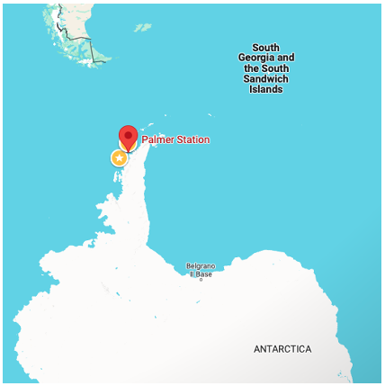
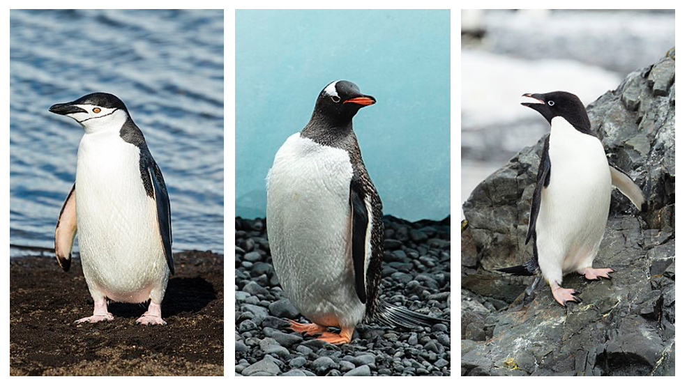
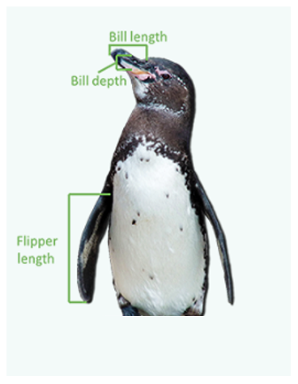

# myprojectPDA
This repository has a project for the module of Principles of Data Analytics
This README has been written with [Github's documentation on READMEs](https://docs.github.com/en/repositories/managing-your-repositorys-settings-and-features/customizing-your-repository/about-readmes) in mind.
You should refer to that documentation for more information on writing an appropriate README for visitors to your repository.
You can find out more about writing in MarkDown [in GitHub's Documentation](https://docs.github.com/en/get-started/writing-on-github/getting-started-with-writing-and-formatting-on-github/basic-writing-and-formatting-syntax)

## About This Project

In this project an analysis is completed using the data from Palmer Penguins Dataset.

The Palmer Penguins dataset is like a treasure trove of information about penguins living near Antarctica. It helps scientists understand how male and female penguins differ in what they eat and how they hunt for food, especially when there's less sea ice around. By studying their diets and body sizes, researchers can figure out why males and females might prefer different hunting spots [[1]](#1) [[2]](#2).      

This dataset is super handy because it's not just for scientists—it's also great for teaching and learning about data analysis. It's like replacing an old, not-so-interesting dataset with something way cooler and more relevant. Plus, it's been downloaded tons of times, showing how popular and useful it is for anyone wanting to explore the world of data science [[3]](#3).     

This data was collected near the Palmer Station in Antarctica from penguins:
- on three different islands: Dream, Torgersen and Biscoe.      

     
*Palmer Station in Antarctica* [[4]](4)     

- Of three difference species: Chinstrap, Gentoo and Adélie.    

    
*Penguins species: Chinstrap (Pygoscelis antarctica), Gentoo (Pygoscelis papua), and Adélie (Pygoscelis adeliae)*  [[5]](5) [[6]](6) [[7]](7)       

4 measurements were taken from each penguin: body mass (g), bill length (mm), bill depth (mm), and flipper length (mm).      

     
*Penguins measurements: bill length, bill depth, flipper length* [[8]](#8)   

## Use of this project

Why this project is useful...

## Get Started 

I sed [openincolab.com](https://openincolab.com) to generate the following clickable link.
It opens the 'fib.ipynb' notebook in [Google Colab](https://colab.research.google.com)

How users can get started with the project...

## Get Help

Where users can get help with your project...

## Contribute

Who maintains and contributes to the project...

## Author

About me...

## References:

<a id="1">[1]</a> Horst, et al. (2022) "Palmer Archipelago Penguins Data in the palmerpenguins R Package - An Alternative to Anderson's Irises", The R Journal. Available at: https://journal.r-project.org/articles/RJ-2022-020

<a id="2">[2]</a> Gorman, et al. (2014) Ecological Sexual Dimorphism and Environmental Variability within a Community of Antarctic Penguins (Genus Pygoscelis). PLOS ONE 9(3): e90081. https://doi.org/10.1371/journal.pone.0090081

<a id="3">[3]</a> Palmer Penguins (2021) UCI Machine Learning Repository. Available at: https://archive.ics.uci.edu/dataset/690/palmer+penguins-3 (Accessed: 26 April 2024). 

<a id="4">[4]</a> Google Maps (2024) Palmer Station, Antarctica, Type of Map: Terrain, Scale: 500km. Available at: https://www.google.com/maps/place/Palmer+Station,+Antarctica/@-60.0342296,-67.7558616,3.36z/data=!4m6!3m5!1s0xbc7f6b08d86317c9:0xe343fed7cb6c11e3!8m2!3d-64.7744286!4d-64.053186!16s%2Fg%2F11l2p50kmk?entry=ttu. 

<a id="5">[5]</a> Shiva, A. (2016) Chinstrap penguin (Pygoscelis antarctica), Wikipedia. Available at: https://en.wikipedia.org/wiki/File:South_Shetland-2016-Deception_Island–Chinstrap_penguin_(Pygoscelis_antarctica)_04.jpg. 

<a id="6">[6]</a> Shiva, A. (2016) Gentoo penguin (Pygoscelis papua), Wikipedia. Available at: https://en.wikipedia.org/wiki/File:Brown_Bluff-2016-Tabarin_Peninsula–Gentoo_penguin_(Pygoscelis_papua)_03.jpg. 

<a id="7">[7]</a> Shiva, A. (2016) Adélie penguin (Pygoscelis adeliae), Wikipedia. Available at: https://en.wikipedia.org/wiki/File:Hope_Bay-2016-Trinity_Peninsula–Adélie_penguin_(Pygoscelis_adeliae)_04.jpg. 

<a id="8">[8]</a> Kakati, M. (2020) Know About The Palmer Penguins!, Tableau. Available at: https://public.tableau.com/views/PalmerPenguin_makeovermonday/Dashboard1?%3Aembed=y&%3AshowVizHome=n&%3Adisplay_count=y&%3Adisplay_static_image=y&%3AbootstrapWhenNotified=true&%3Alanguage=en&%3Amobile=true&%3AapiID=host0. 